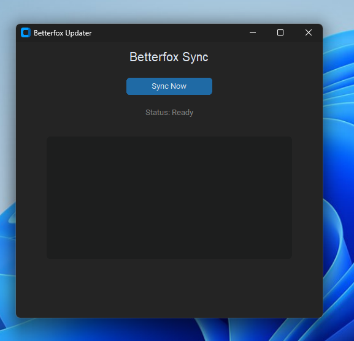
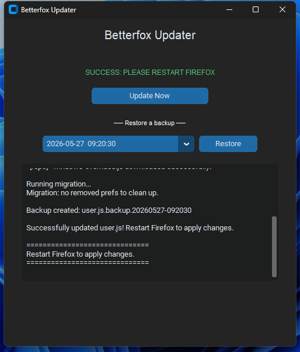

# Betterfox Updater
A cross-platform, Python-based utility designed to automate the installation of [Betterfox](https://github.com/yokoffing/Betterfox) while preserving custom user overrides.

This project was inspired by [Betterfox Issue #167](https://github.com/yokoffing/Betterfox/issues/167) and aims to solve the "stalled updater" problem by providing a modular, hardware-aware sync tool.

<p align="center">
    
    
</p>

⚠️ Antivirus Notice

The macOS executable may be flagged by Microsoft Defender as a false positive. This is a known issue with unsigned Python executables built with PyInstaller — the binary is not malicious. The Windows executable has been patched to avoid this. If you are concerned, you can verify the build yourself by running from source via the developer setup below, or inspect the full source code in this repo.

## ✨ Key Features

- **Intelligent Profile Detection**: Automatically locates the default-release Firefox profile across Windows, macOS, and Linux.

- **Modular Overrides**: Merges the latest Betterfox user.js with your personal tweaks (`common-overrides.js`, `windows-overrides.js`, `mac-overrides.js`, or `linux-overrides.js`). Missing override files are automatically downloaded from the repo as a fallback.

- **Hardware Aware**: Tailors performance settings for specific hardware, such as Nvidia RTX GPUs or Apple Silicon (M3).

- **Firefox Running Detection**: Warns you if Firefox is open before syncing, so you know to restart it after the update applies.

- **Backup & Restore**: Automatically creates a timestamped backup before every sync and keeps the last 5. A built-in restore menu lets you roll back to any previous configuration without touching the file system.

- **Modern GUI**: Includes a simple interface with a live progress log.

## To-do
- [ ] Add an app icon
- [ ] Hardware detection to match override files to detected GPU/CPU

## How to Use

1. Download the latest release for your system from the [Releases](../../releases) page.
2. Place any override files you want to customize (`common-overrides.js`, `windows-overrides.js`, `mac-overrides.js`, `linux-overrides.js`) in the same folder as the updater. If a file isn't found locally, it will be downloaded from this repo automatically.
3. Run the application and click **Sync Now**.
4. Restart Firefox to apply changes.

To roll back a sync, select a backup from the **Restore a backup** dropdown and click **Restore**, then restart Firefox. Up to five backups are saved.

## 🛠 Developer Setup

If you want to run the script manually or contribute to the project:

**1. Clone & set up environment**
```
git clone https://github.com/aaronplayz-sys/betterfox-updater.git
cd betterfox-updater
python -m venv .venv
```

**2. Activate virtual environment**

Windows: `.venv\Scripts\activate`

macOS / Linux: `source .venv/bin/activate`

**3. Install dependencies**
```
pip install requests customtkinter psutil
```

> `psutil` is optional but recommended — it enables Firefox running detection. The app works without it.

**4. Run the application**

CLI: `python update_betterfox.py`

GUI: `python gui_test.py`

## 🔨 Building the Executable

Releases are built automatically via GitHub Actions when a version tag is pushed. To build manually:

```
pip install pyinstaller
```
```
pyinstaller --noconsole --onefile --collect-all customtkinter --hidden-import psutil --name BetterfoxUpdater gui_test.py
```

> **Linux only**: tkinter must be installed separately before building.
> ```
> sudo apt-get install python3-tk
> ```

## 🚀 Releasing a New Version

Push a version tag and GitHub Actions will build all three platform executables and attach them to a GitHub Release automatically:

```
git tag v1.0.0
git push --tags
```

The workflow builds on `windows-latest`, `macos-latest`, and `ubuntu-latest` in parallel. The release will appear under the [Releases](../../releases) tab once all three jobs complete.
