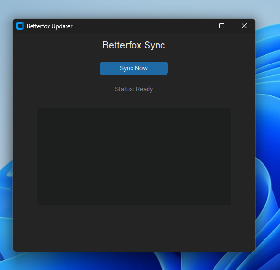
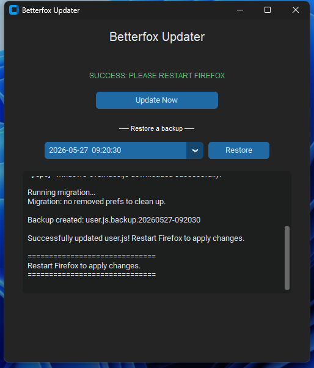

# Betterfox Updater
A cross-platform, Python-based utility designed to automate the installation of [Betterfox](https://github.com/yokoffing/Betterfox) while preserving custom user overrides.

This project was inspired by [Betterfox Issue #167](https://github.com/yokoffing/Betterfox/issues/167) and aims to solve the "stalled updater" problem by providing a modular, hardware-aware sync tool.

Images below is a preview of what the app looks like on Windows 11, looks are simular with MacOS and Linux.

<p align="center">
    
    
</p>

## ⚠️ Antivirus Notice

Some antivirus engines may flag this app as suspicious. This is a known false positive with unsigned Python executables. The binary is not malicious. All reported detections have been investigated and confirmed clean by several vendors.

Microsoft Defender (Windows): The PyInstaller bootloader is rebuilt from source during CI to avoid the common Wacatac.B!ml heuristic signature. If you still see a warning, submit a false positive report at [microsoft.com/en-us/wdsi/filesubmission](https://www.microsoft.com/en-us/wdsi/filesubmission).

Microsoft Defender (macOS): Unsigned macOS binaries are more likely to trigger heuristic scanners. Submit a false positive report at the same link above if flagged.

Bitdefender ATC4: the Start with System feature writes to the Windows registry (HKCU\Run) to register the app at login, which behavioral engines can flag as a persistence mechanism. This has been confirmed clean by Bitdefender. If flagged, add the executable to Bitdefender's exceptions under Settings → Antivirus → Exceptions, or submit a false positive report at [bitdefender.com/consumer/support/answer/29358.](https://www.bitdefender.com/consumer/support/answer/29358/)

If you are concerned about any detection, you can verify the build yourself by running from source via the developer setup below, or inspect the full source code and CI workflow in this repo.

## 🦊 Supported Browsers

This app currently only detects and updates a **standard, vanilla installation of Firefox**. It locates your profile via Firefox's own `profiles.ini`, which forks and portable builds don't always populate the same way.

**Not currently supported:**
- Firefox forks (LibreWolf, Waterfox, Zen Browser, etc.)
- Portable / standalone Firefox builds that don't write to the usual profile locations

Support for forks may be added in a future version, see the [To-do](#to-do) list below. If you'd like to help test or contribute detection logic for a specific fork, please open an issue or PR.

## ✨ Key Features

- **Intelligent Profile Detection**: Automatically locates the default-release Firefox profile across Windows, MacOS, and Linux.

- **Modular Overrides**: Merges the latest Betterfox user.js with your personal tweaks (`common-overrides.js`, `windows-overrides.js`, `mac-overrides.js`, or `linux-overrides.js`). Missing override files are automatically downloaded from the repo as a fallback.

- **Hardware Aware**: Automatically detects your GPU or CPU and applies the right override file. Covers NVIDIA, AMD, and Intel GPUs on Windows and Linux; Apple Silicon vs Intel on MacOS.

- **Firefox Running Detection**: Warns you if Firefox is open before syncing, so you know to restart it after the update applies.

- **Backup & Restore**: Automatically creates a timestamped backup before every sync and keeps the last 5. A built-in restore menu lets you roll back to any previous configuration without touching the file system.

- **Modern GUI**: Includes a simple interface with a live progress log.

- **Scheduled Checks**: Automatically check upstream user.js changes with a specified interval.

- **Start on system boot**: Have the app run automatically in the background when you start your system.

## To-do
- [x] Add an app icon
- [x] Hardware detection to match override files to detected GPU/CPU
- [x] Notify user that user.js has been updated and suggest to update
- [x] Notify user that the app has been updated and suggest to update.
- [x] Tray icon / minimize to tray (MacOS needs a diffrent solution)
- [x] Scheduled auto-checks
- [x] Start with System
- [x] First-run welcome screen
- [x] Open profile folder button
- [x] Diff view in the log
- [x] Replace Linux binary with an AppImage (added along with binary, not replaced)
- [ ] MacOS tray (proper native implementation) [Borked, may revisit in the future]
- [ ] Localization, would need help
- [ ] Support for Firefox forks (LibreWolf, Waterfox, Zen Browser, etc.) and portable installs
- [ ] Proper settings window, dedicated settings tab or dialog to give room to grow without cluttering the primary sync/update screen
- [ ] Rollback safety net, dry-run showing exactly what would change before committing
- [ ] Update check on the log itself, a small "X days since last check" or "last synced: <date>" in the main window
- [ ] Dark/light theme toggle
- [ ] Export/import settings, the ability to backup config.json and override files as a zip

## How to Use

1. Download the latest release for your system from the [Releases](../../releases) page.
   > **Linux users:** the `.AppImage` is recommended. It bundles all dependencies and requires no system packages beyond FUSE (present on most distros). The raw `BetterfoxUpdater-Linux` binary is also available if you prefer to manage dependencies yourself. Make the AppImage executable before running: `chmod +x BetterfoxUpdater-x86_64.AppImage`
   >
   > **Known limitation:** Native update notifications do not work under the AppImage due to how its read-only mount interacts with plyer's platform detection. Scheduled checks still run correctly. The raw `BetterfoxUpdater-Linux` binary does not have this limitation.

2. Place any override files you want to customize in the same folder as the updater. If a file isn't found locally, it will be downloaded automatically.

   | File | Applied when |
   |---|---|
   | `common-overrides.js` | Always |
   | `windows-overrides.js` / `mac-overrides.js` / `linux-overrides.js` | Matches your OS |
   | `nvidia-overrides.js` / `amd-overrides.js` / `intel-gpu-overrides.js` | Matches your GPU (Windows / Linux) |
   | `apple-silicon-overrides.js` / `apple-intel-overrides.js` | Matches your Mac chip (macOS) |
3. Run the application and click **Sync Now**.
4. Restart Firefox to apply changes.

To roll back a sync, select a backup from the **Restore a backup** dropdown and click **Restore**, then restart Firefox.

## 🛠 Developer Setup

If you want to run the script manually or contribute to the project:

**1. Clone & set up environment**
```
git clone https://github.com/aaronplayz-sys/betterfox-updater.git
cd betterfox-updater
python -m venv .venv
```

**2. Activate virtual environment**

Windows: `.venv\Scripts\activate`

macOS / Linux: `source .venv/bin/activate`

**3. Install dependencies**
```
pip install -r requirements.txt
```

> `psutil` is optional but recommended — it enables Firefox running detection. The app works without it.

**4. Run the application**

CLI: `python update_betterfox.py`

GUI: `python app.py`

## 🔨 Building the Executable

Releases are built automatically via GitHub Actions when a version tag is pushed. To build manually:

```
pip install pyinstaller
```
```
pyinstaller --noconsole --onefile --collect-all customtkinter --hidden-import psutil --hidden-import pystray --hidden-import plyer --icon assets/favicon.ico --add-data "assets/favicon.ico;." --name BetterfoxUpdater app.py
```

> **Linux only**: tkinter and tray dependencies must be installed separately before building.
> ```
> sudo apt install python3-tk python3-gi gir1.2-ayatanaappindicator3-0.1
> ```

## 🚀 Releasing a New Version

Push a version tag and GitHub Actions will build all three platform executables and attach them to a GitHub Release automatically:

```
git tag v1.0.0
git push --tags
```

The workflow builds on `windows-latest`, `macos-latest`, and `ubuntu-latest` in parallel. The release will appear under the [Releases](../../releases) tab once all three jobs complete.
